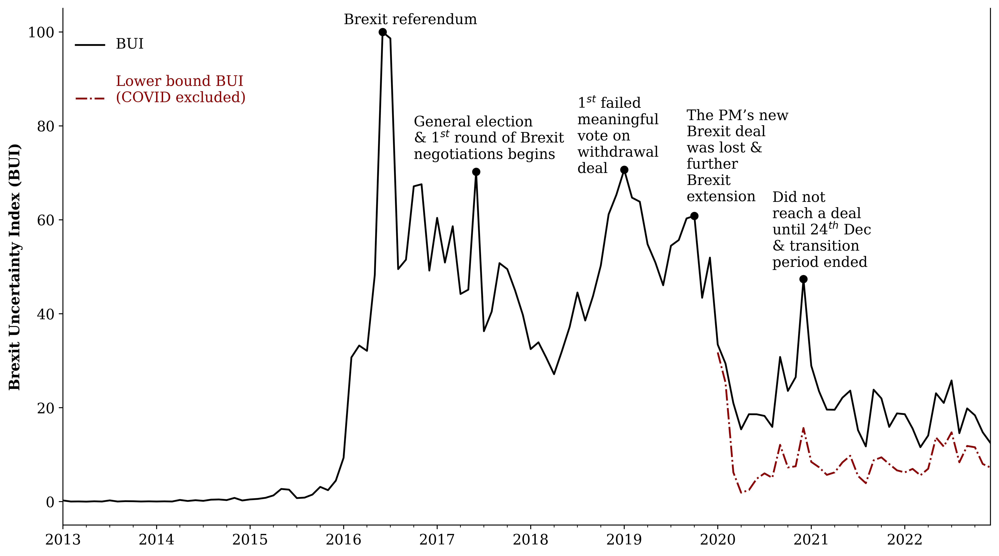
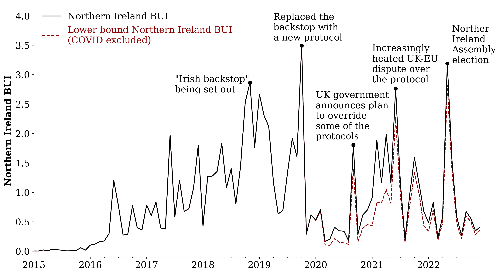
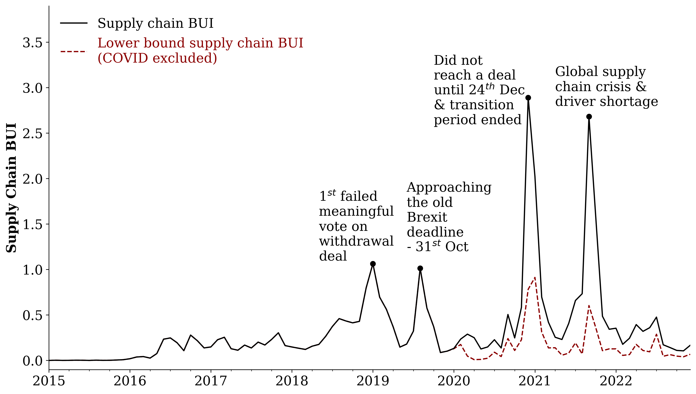
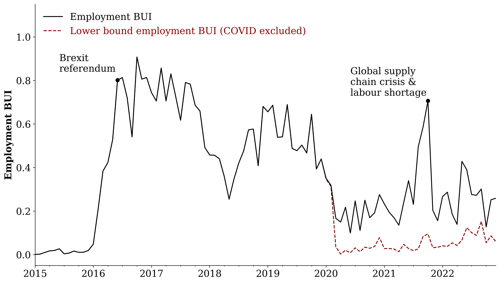
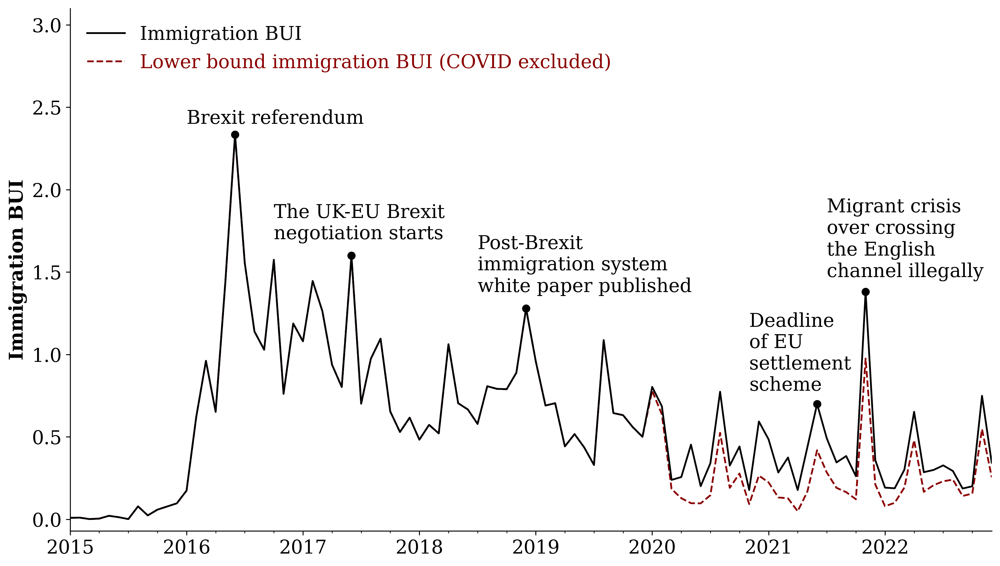
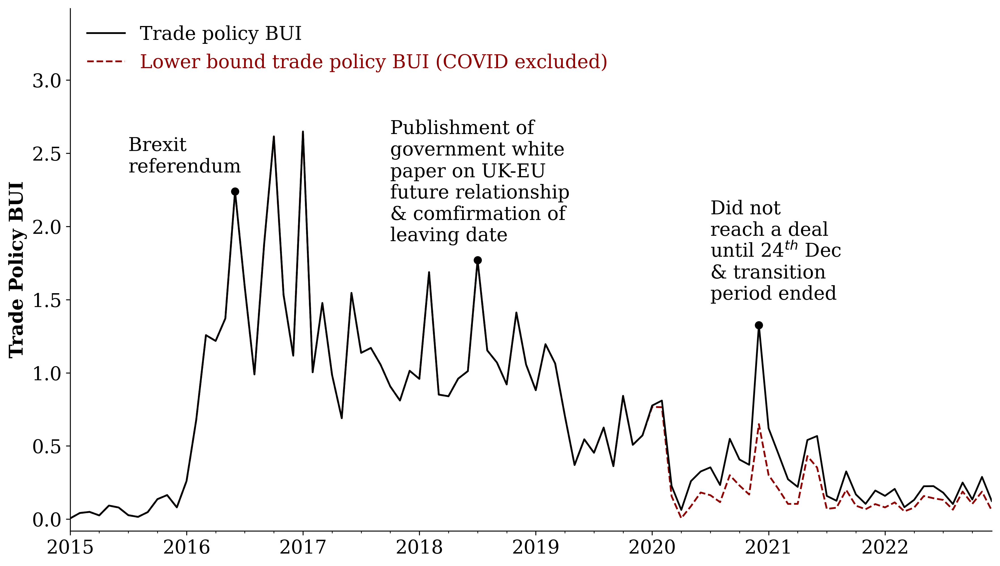
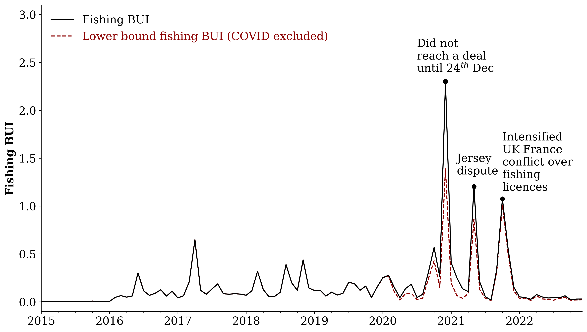
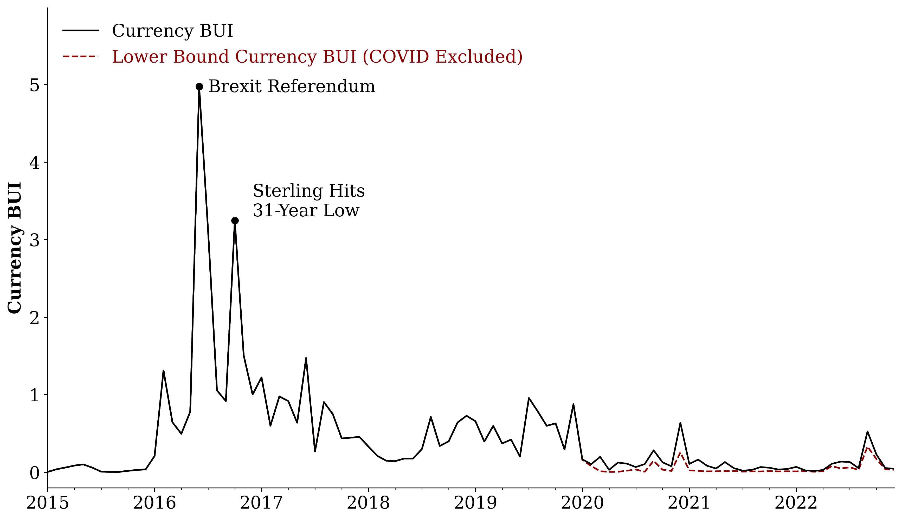
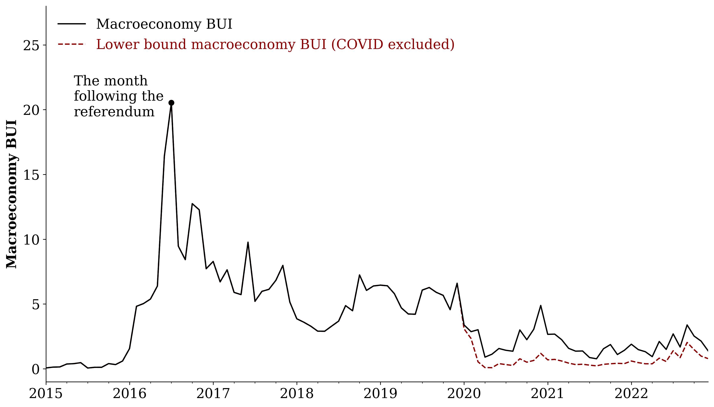

---
# layout style
layout: single

# toc
toc: true
toc_sticky: true # floating toc
title: Brexit Uncertainty Index
---

*All data, graphs and analyses on this site should be cited as [Chung, Dai and Elliott (2022)](https://cepr.org/publications/dp17410)*

**Project Summary**
- We construct novel news-based indicators of Brexit uncertainty at both aggregate and topic-specific level for the UK economy  (such as Northern Ireland, supply chain issues, and energy & climate), based on textual analysis and unsupervised machine learning methods.

- These Brexit uncertainty indices (BUI) capture well UK firms’ concerns reported by the Bank of England’s Decision Maker Panel surveys.

- These monthly indices are cost-effective and can be updated in close to real time, which are advantageous to policy evaluation compared to traditional large firm surveys.

- They also allow for disentangling the Brexit effects from those of the COVID-19 pandemic. We find that the pandemic accounted for around half of the overall uncertainty index post 2020, and this magnification effect varies significantly across policy areas.

## Aggregate Brexit Uncertainty Index

### Aggregate BUI (2013- December 2022)


-BUI: A monthly index based on the frequency of news articles that concern Brexit uncertainty. The index is normalized to a maximum value of 100. 

- Lower Bound BUI: A monthly index based on the frequency of news articles that concern Brexit uncertainty, excluding all articles mentioning COVID related words after January 2020. 

#### Comparison to Twitter BUI
.png)

- Twitter BUI: An index that we construct based on the same methodology for the news-based BUI, but using instead the frequency of Twitter tweets concerning Brexit uncertainty.
#### Comparison to Stock Market Volatility


- VFTSE: the FTSE 100 Volatility Index (VFTSE), representing the implied volatility on the FTSE 100, available until June 2019. Data source: Bloomberg.

## 	Topic-level Brexit Uncertainty Indices

### Northern Ireland


### Supply Chain


### Energy & Climate


### Employment


### Immigration


### Trade Policy


### Fishing Dispute


### Currency


### Macroeconomy


### Contact us for more topics:

+ Government Spending & Budget 
+ Tax
+ Housing Price 
+ Food Industry
+ Manufacturing
+ Scotland

<!-- this is a demo of adding image to your page -->
<!-- ## Adding image

- copy you image files to folder /assets/images/
- use `````` to add image to your page

here is an example of your index.md file:
    
```md

```

it looks like this:
 -->

